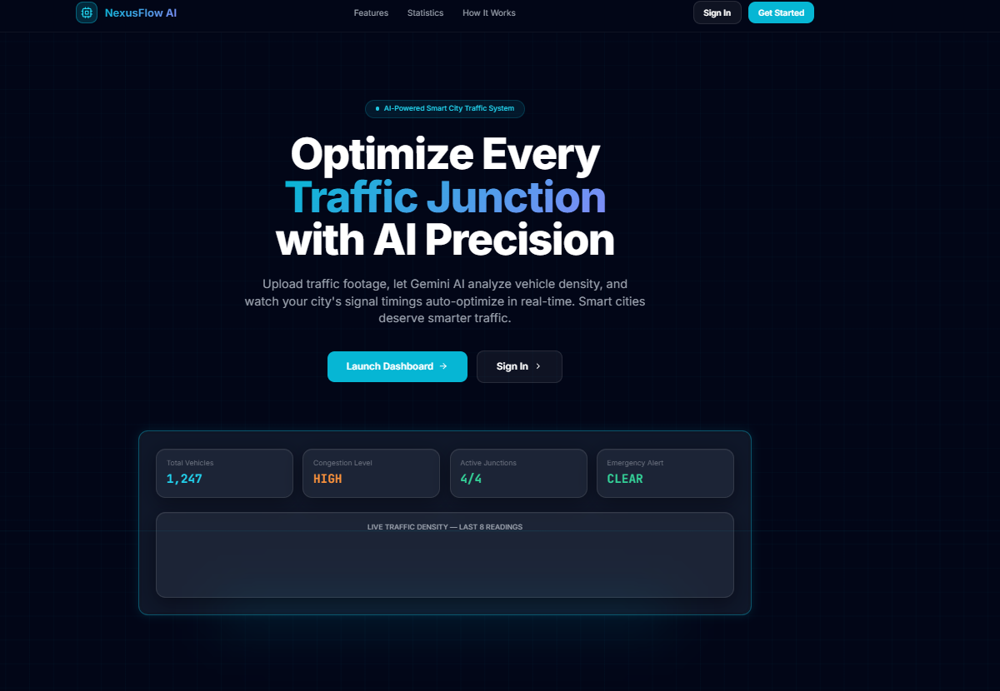
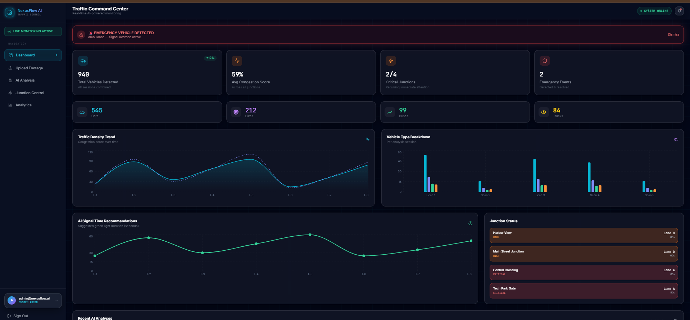
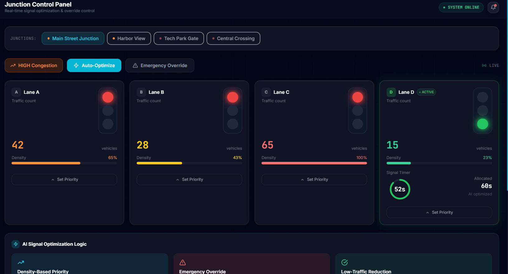
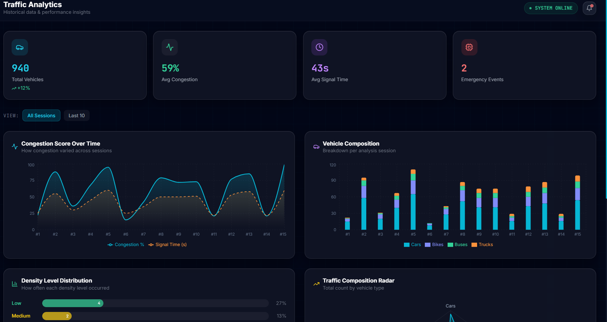

# 🚦 NexusFlow AI — Smart Traffic Junction Optimization System


> **AI-powered smart city traffic management system that automatically optimizes signal timings, detects emergency vehicles, and monitors junctions in real time.**

🔗 **Live Demo:** [traffic-management-fw75.vercel.app](https://traffic-management-fw75.vercel.app)

---

## 📋 Table of Contents

- [Problem Statement](#-problem-statement)
- [Solution](#-solution)
- [Features](#-features)
- [Tech Stack](#-tech-stack)
- [How It Works](#-how-it-works)
- [System Architecture](#-system-architecture)
- [Screenshots](#-screenshots)
- [AI Signal Optimization Logic](#-ai-signal-optimization-logic)
- [Getting Started](#-getting-started)
- [Project Structure](#-project-structure)
- [Future Scope](#-future-scope)

---

## 🎯 Problem Statement

Traffic congestion at road junctions is a major issue in modern cities. Most traffic signals operate on **fixed timing systems** — regardless of actual traffic density on each lane. This leads to:

- 🚗 Vehicles waiting unnecessarily on empty roads
- 🚑 Emergency vehicles (ambulances, fire trucks) facing delays
- ⛽ Increased fuel consumption and pollution
- 🏙️ Overall poor junction efficiency

---

## 💡 Solution

**NexusFlow AI** is an AI-based junction optimization system that:

- Analyzes real traffic footage using **Google Gemini Vision AI**
- **Automatically adjusts signal timings** based on live vehicle density
- **Detects emergency vehicles** and grants instant signal priority
- Provides a **real-time monitoring dashboard** for all junctions
- Stores and analyzes **historical traffic data** for congestion prediction

---

## ✨ Features

### 🤖 AI-Powered Vehicle Detection
- Upload images or videos from any junction camera
- Google Gemini Vision AI counts vehicles with high accuracy
- Detects vehicle types — Cars, Bikes, Buses, Trucks
- Calculates real-time congestion score (0–100%)

### 🚦 Dynamic Signal Control
- Signal timings automatically adjust based on traffic density
- High traffic lane → Maximum green time (up to 65 seconds)
- Low traffic lane → Minimum green time (15 seconds)
- No more fixed timers — fully AI-driven optimization

### 🚨 Emergency Vehicle Override
- Instant detection of ambulances, fire trucks, police vehicles
- All non-emergency lanes immediately put on hold
- Emergency lane receives 60 seconds full green clearance
- AI recommendation: *"Override all signals for immediate clearance"*

### 📊 Live Analytics Dashboard
- Real-time congestion score over time graph
- Vehicle composition breakdown (Cars, Bikes, Buses, Trucks)
- Density level distribution (Low / Medium / High / Critical)
- Signal Time vs Congestion correlation chart
- Traffic Composition Radar visualization

### ⚡ Supabase Realtime Updates
- Every AI analysis instantly reflects on the dashboard
- Junction Control Panel updates automatically
- No manual refresh needed — live push updates

### 🔐 Secure Authentication
- User signup and login system
- Protected dashboard routes
- Role-based access (System Admin)

---

## 🛠️ Tech Stack

| Technology | Purpose |
|---|---|
| **Next.js** | Frontend framework |
| **Google Gemini Vision AI** | Vehicle detection & analysis |
| **Supabase** | Database, Auth, Storage, Realtime |
| **Supabase Realtime** | Live dashboard updates |
| **Supabase Storage** | Traffic footage storage |
| **Vercel** | Deployment & hosting |
| **Tailwind CSS** | UI styling |

---

## 🔄 How It Works

```
📸 STEP 1: Upload Traffic Footage
          ↓
    User uploads image/video from junction camera
    (JPG, PNG, WEBP, MP4, MOV, AVI — Max 100MB)

🧠 STEP 2: Gemini AI Analysis
          ↓
    Gemini Vision API analyzes the footage
    → Counts total vehicles
    → Identifies vehicle types (Cars/Bikes/Buses/Trucks)
    → Detects emergency vehicles
    → Calculates congestion score (0–100%)
    → Generates signal time recommendation

🚦 STEP 3: Automatic Signal Optimization
          ↓
    AI recommendation is applied to Junction Control
    → Signal timings updated automatically
    → Dashboard reflects changes via Supabase Realtime
    → Emergency override activated if needed
    → Analytics data stored for historical analysis
```

---

## 🏗️ System Architecture

```
┌─────────────────────────────────────────────┐
│              NexusFlow AI System             │
├─────────────────────────────────────────────┤
│                                             │
│  📸 Camera Footage                          │
│       ↓                                     │
│  🗄️  Supabase Storage                       │
│       ↓                                     │
│  🧠  Gemini Vision API                      │
│       ↓                                     │
│  📊  Analysis Results → Supabase Database   │
│       ↓                                     │
│  ⚡  Supabase Realtime                      │
│       ↓                                     │
│  🖥️  Live Dashboard Update                  │
│       ↓                                     │
│  🚦  Junction Control Panel                 │
│                                             │
└─────────────────────────────────────────────┘
```

---

## 📸 Screenshots

### 🏠 Landing Page


- Project overview with feature highlights
- How It Works — 3 step process
- Live system statistics

### 📊 Traffic Command Center (Dashboard)

- Live vehicle count across all sessions
- Average congestion score
- Critical junction alerts
- Emergency event tracking
- Traffic density trend graph
- Vehicle type breakdown chart

### 📤 Upload Footage

- Select target junction
- Drag & drop image/video upload
- Supports 4 junctions simultaneously

### 🤖 AI Analysis Page

- Footage analysis history (Pending / Completed)
- Real-time analysis results
- Vehicle type breakdown with donut chart
- Congestion percentage gauge
- AI recommendation text

### 🚦 Junction Control Panel

- 4-lane real-time signal view
- Live signal timer countdown
- Traffic density per lane
- Emergency Override button
- Auto-Optimize button
- AI Signal Optimization Logic explanation
- Signal Time Allocation bar chart

### 📈 Analytics Page

- Congestion Score Over Time graph
- Vehicle Composition per session
- Density Level Distribution (Low/Medium/High/Critical)
- Traffic Composition Radar chart
- Signal Time vs Congestion Correlation scatter plot

---

## 🧠 AI Signal Optimization Logic

The system follows **3 core rules** for every signal decision:

### 1. 📈 Density-Based Priority
> Lane with the highest vehicle count receives the longest green duration (up to 65 seconds). All other lanes are reduced proportionally based on their vehicle density.

### 2. 🚨 Emergency Override
> When an emergency vehicle is detected, all non-priority lanes immediately hold. The active emergency lane receives 60 seconds of uninterrupted green signal and all other signals are cleared for safe passage.

### 3. 🟢 Low-Traffic Reduction
> Lanes with less than 30% density receive a minimum of 15 seconds green time only. This prevents unnecessary idling on empty roads and reduces fuel waste.

---

## 🚀 Getting Started

### Prerequisites
- Node.js 18+
- Supabase account
- Google Gemini API key

### Installation

```bash
# Clone the repository
git clone https://github.com/Ayushi2006Sahu/TrafficManagement.git

# Navigate to project directory
cd nexusflow-ai

# Install dependencies
npm install
```

### Environment Variables

Create a `.env.local` file in the root directory:

```env
NEXT_PUBLIC_SUPABASE_URL=your_supabase_url
NEXT_PUBLIC_SUPABASE_ANON_KEY=your_supabase_anon_key
GEMINI_API_KEY=your_gemini_api_key
```

### Run Development Server

```bash
npm run dev
```

Open [http://localhost:3000](http://localhost:3000) in your browser.

### Build for Production

```bash
npm run build
npm start
```

---

## 📁 Project Structure

```
nexusflow-ai/
├── app/
│   ├── page.tsx              # Landing page
│   ├── login/                # Login page
│   ├── signup/               # Signup page
│   └── dashboard/
│       ├── page.tsx          # Main dashboard
│       ├── upload/           # Upload footage
│       ├── analysis/         # AI Analysis
│       ├── junction/         # Junction Control
│       └── analytics/        # Analytics
├── components/               # Reusable UI components
├── lib/
│   ├── supabase.ts           # Supabase client
│   └── gemini.ts             # Gemini AI integration
├── public/                   # Static assets
└── README.md
```

---

## 🔮 Future Scope

- 🎥 **Direct CCTV Integration** — Live camera feed instead of manual upload
- 🗺️ **City-wide Map View** — All junctions on an interactive map
- 📱 **Mobile App** — For traffic operators on the go
- 🤖 **Predictive AI** — Predict congestion before it happens using historical patterns
- 🔔 **SMS/Email Alerts** — Notify authorities during critical congestion
- 🚗 **Vehicle Tracking** — Track specific vehicle types across junctions
- 🌐 **Multi-city Deployment** — Scale to multiple cities simultaneously

---

## 👩‍💻 Built For

> **AI-Based Junction Optimization System** — Hackathon / Competition Project

Solving real-world traffic problems using cutting-edge AI technology for smarter, safer, and more efficient cities.

---

## 📄 License

This project is built for educational and competition purposes.

---

<div align="center">

**Built with ❤️ using Next.js + Gemini AI + Supabase**

⭐ Star this repo if you found it useful!

</div>
